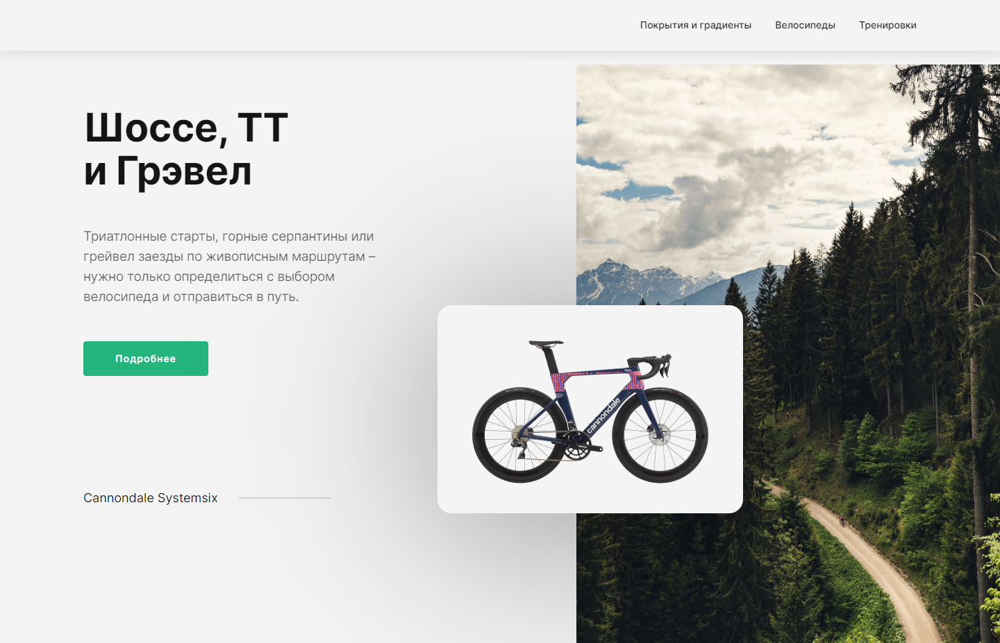

# Bicycles

---

## 🌐 Ссылки

* [Bicycles]() - страница на хостинге GH Pages;
* [Figma](https://www.figma.com/file/G3UWFlQmNtNs67751YiDH2/Month-of-Landings_external-link?type=design&node-id=0-1&t=CgedVv0dBz0V0RKf-0) - макет проекта;

---

## 📗 О проекте Bicycles
__Bicycles__ — проект, посвященный профессиональному и любительскому велоспорту на открытых пространствах.

На сайте представлен обзор трех видов велосипедов:
* __Шоссейный__ — для асфальта на разных градиентах;
* __ТТ__ — для равнинного асфальта;
* __Грэвел__ — для легкого бездорожья.

А также разделы:

__Велосипеды__ с _топовыми моделями_ разных видов для покупки на стороннем маркетплейсе.

__Тренировки__ с ресурсами для поиска маршрутов.

_Главная страница_

---

## 🥣 Немного о реализации
* Реализована _front-end_ часть главной страницы Bicycles.
* Проект _свёрстан_ с использованием технологий адаптивной вёрстки и отзывчивого интерфейса для наиболее популярных разрешений.
* При стилизации используется _nested-структура_.
* Стили написаны с использованием препроцессора SASS.
* Реализовано раскрывающееся основное меню типа _burger_.
* Cтраницу открывает раздел с основной информацией о проекте, включающий _sticky-элемент_.
* Секция __Шоссе - Грэвел - ТТ__ включает в себя _адаптивный слайдер_.
* Секция __Велосипеды__ включает _адаптивный чекбокс_ выбора типов велосипедов и _слайдер_ карточек на мобильном разрешении.
* Секция __Тренировки__ построена на _grid'ах_.
* __Подвал__ сайта включает _форму_ для подписки на рассылку.
* Сайт стилизован для __светлой__ и __темной__ тем, переключение которых обеспечивается __кнопкой__:
  * __В подвале__ сайта для разрешений экрана _выше 425px_;
  * __В основном__ меню для разрешений экрана _425px и ниже_.
* Сборка проекта, минимизация и транспиляция кода на JS происходит с помощью инструмента __Webpack__ и сопутствующих плагинов.

---

## 📈 Планы по развитию проекта
* Реализовать другие страницы и разделы проекта
* Настроить кастомную валидацию формы подписки
* Подключить back-end часть для отправки формы подписки
* Перестроить логику работы темной темы на базу переменных
* Улучшить юзабилити интерактивных элементов для клавиатуры
* Улучшить юзабилити слайдеров для клавиатуры
---

## ⚙️ Cтек технологий
HTML, CSS & SASS, JavaScript, WebPack, GitHub

          

---

## 💪 Разработка

Разработка велась единолично
[Виктор Тарапата](https://github.com/vveb) ✊\

---

### 📜 Инструкция по запуску на локальной машине

- Установить [Node.js](https://nodejs.org/ru/)
- Клонировать репозиторий ` git clone git@github.com:Andrey-Grishkov/Everland.git`
- Установить зависимости `npm install`
- Запустить приложение `npm run dev`
